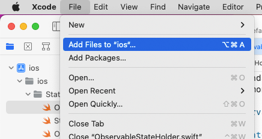
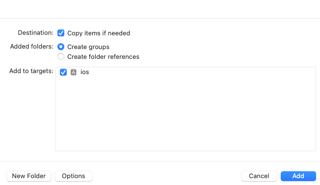

# Work in Progress

Project is under development.

## Overview!

Provide observable state to your Jetpack Compose and SwiftUI modules from Kotlin Multiplatfrom
Shared module with near zero boilerplate.

### Declare your state in Shared

First make your class a `StateHolder` by interface delegation and then use a simple `state` property
delegate which will wrap the provided value properly to allow observation on platforms.

```Kotlin
class SimpleViewModel : KmmViewModel(), StateHolder by StateHolder() {

    var message by state("Hello World")
        private set

    var isLoading by state(false)
        private set

    fun updateMessage() = viewModelScope.launch {
        isLoading = true
        delay(500)
        message = "Hello kstate"
        isLoading = false
    }
}
```

### Observe state on platforms

Create `SimpleViewModel` in any way an receive state updates.

```kotlin
@Composable
fun SimpleScreen() {

    val viewModel: SimpleViewModel = viewModel { SimpleViewModel() }

    Box(modifier = Modifier.fillMaxSize()) {
        Greeting(
            modifier = Modifier
                .align(Alignment.Center)
                .clickable { viewModel.updateMessage() },
            text = viewModel.message
        )
    }
}
```

Use a proper property wrapper generated by library to wire state observation on iOS.

```Swift
struct SimpleView: View {
    
    @ObservedStateHolder var viewModel = SimpleViewModel()
    
	var body: some View {
        Text(viewModel.message)
            .onTapGesture {
                viewModel.updateMessage()
            }
	}
}
```

## Generate Swift wrappers

To generate Swift wrappers apply `kstate-generate` plugin, configure generation destination and shared module name.
Output dir should point to a place in your iOS project where you would like to have wrappers.
```kotlin
plugins {
    id("com.jstarczewski.kstate.generate").version("0.1.1")
}

generationConfig {

    create("ios") {
        outputDir.set("ios/ios/StateHolder")
        sharedModuleName.set("common")
    }
}
```
After succesfully applying the plugin run gradle task to generate `Swift` files.
```
./gradlew generateSwiftTemplates
```
To link generated files with your project, from XCode `File` menu click `Add files` and create group with sources.
After addition, run the `iOS` app to check whether everything builds. Maybe there are additional changes needed to be done in the files, but 
the vision is that after linking generated sources iOS app should build without anny issues. 






